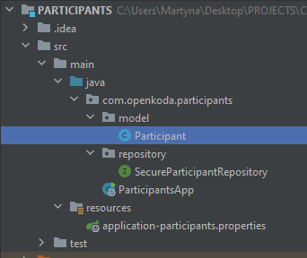
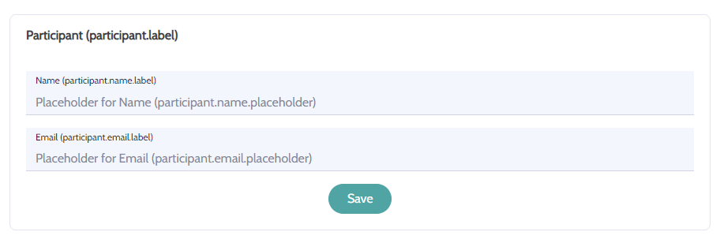
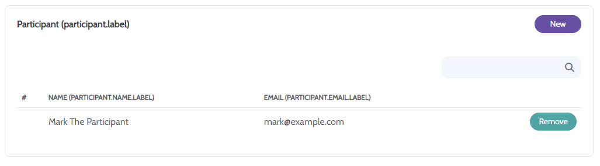
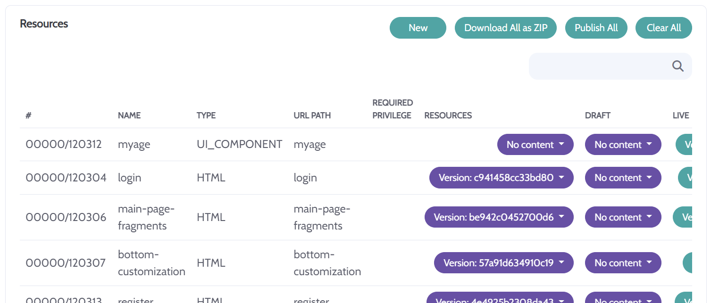
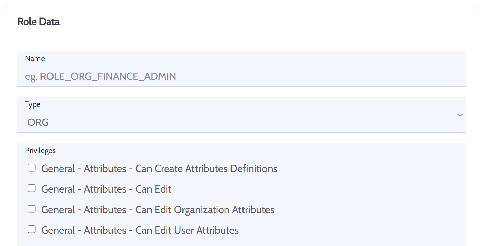

# Openkoda Introduction

## What can be done

### Frontend

It is possible to create custom webpages within the Openkoda Admin Panel (https://example.com/html/frontendresource/all)

```<!DOCTYPE html>
<html xmlns:th="http://www.thymeleaf.org">
  <body>
	<span>Hello with Openkoda!</span> 
  </body>
</html>
```

### Simple Services

Openkoda makes it possible to create simple services in the Admin Panel (https://example.com/html/webendpoints/all).

The below example displays the age count on the basis of date parameter passed with the request.

We have a html snippet to display the information:

```<!DOCTYPE html>
<html xmlns:th="http://www.thymeleaf.org">
  <body>
	You are <span th:text="${age}"> </span> years old. 
  </body>
</html>
```

and the JS snippet which contains the service to count the age:

```
flow.thenSet("age", a => mySimpleService.calculateAge(a.model.get("params").get("date")));

let mySimpleService = {
  calculateAge: function(d) {
	let date = new Date(d);
  	let ms = date.getTime();
	let now = new Date();
	return Math.floor((now.getTime() - date.getTime()) / (3600 * 10 * 24 * 36525));
  }
};
```

So for example, when https://example.com/myage?date=1981-01-09 is requested, you will see the
message `You are 42 years old.`

### Simple Integrations

Integration triggers can be configured here:\
https://example.com/html/eventlistener/new/settings

Integration channels are available for configuration on organization settings level at\
https://example.com/html/organization/<organization-id>>/module/integration/settings

* email messages\
  Can be triggered with methods:
    * EmailService :: sendAndSaveEmail(CanonicalObject)
    * PushNotificationService :: createEmailNotification(NotificationDto)

* Slack notifications\
  Can be triggered with methods:
    * SlackService :: sendToSlackWithCanonical(CanonicalObject)
    * PushNotificationService :: createSlackPostMessageRequest(NotificationDto)

* MsTeams notifiactions\
  Can be triggered with method:
    * PushNotificationService :: createMsTeamsPostMessageRequest(NotificationDto)
* Trello cards\
  Can be triggered with method:
    * TrelloIntegrationConsumers :: createTrelloCardFromOrgNotification(NotificationDto)
* Jira tasks\
  To enable Jira integrations through admin panel you need to set global properties for your app:
    * jiraClientId (`module.integration.jira.client.id`)
    * jiraClientSecret (`module.integration.jira.client.secret`)\

  Creating Jira notifications can be triggered with method:
    * JiraIntegrationConsumers :: createJiraIssueFromOrgNotification(NotificationDto)
* GitHub tasks\
  To enable GitHub integrations through admin panel you need to set global properties for your app:
    * gitHubClientId (`module.integration.github.client.id`)
    * gitHubClientSecret (`module.integration.github.client.secret`)\

  Creating GitHub notifications can be triggered with method:
    * GitHubIntegrationConsumers :: createGitHubIssueFromOrgNotification(NotificationDto)
* Basecamp tasks\
  To enable Basecamp integrations through admin panel you need to set global properties for your app:
    * basecampClientId (`module.integration.basecamp.client.id`)
    * basecampClientSecret (`module.integration.basecamp.client.secret`)\

  Creating Basecamp notifications can be triggered with method:
    * BasecampIntegrationConsumers :: postBasecampToDo(NotificationDto)

## When would you need a Java App

### Data Model

Define data model for your application as Entities in Java.

It is very important to think this through properly as it would then be the basis to customize everything else.

TODO: will be completed after Spring Boot and Hibernate upgrade is finished

### CRUD

Implement full CRUD operations for custom entities of your choice.

First, create CRUD form structure for the entity:

```
FormDefinition deskForm = createFormDefinition("desk", readOrgData, manageOrgData,
            a -> a
                .text("description")
                .datalist("rooms", f -> SecureEntityDictionaryRepository.enumsToMapWithLabels(Desk.Room.values()))
                .datalist("chairs", f -> SecureEntityDictionaryRepository.enumsToMap(Desk.Chair.values()))
                .dropdown("room", "rooms" )
                .dropdown("chair", "chairs" )
                .checkbox("hasSetup" )
                .files("filesId", f -> f.getDictionaryRepository().getFileDtos((Desk)(((ReflectionBasedEntityForm)f).entity)), "image/png,image/jpeg")
    );
```

and then register the CRUD controller:

```
@PostConstruct
    void init() {
        customisationService.registerAuditableClass(Desk.class, "Desk");

        customisationService.registerOnApplicationStartListener(
                a -> controllerConfigurationMap.registerCRUDControllerBuilder(
                    deskForm, secureDeskRepository, ReflectionBasedEntityForm.class)
            .setGenericTableFields("room", "chair", "description")
                        .setDefaultControllerPrivilege(readOrgData));
    }
```

The list of URLs generated for Desk entity CRUD in organization context would be:

* `/html/organization/<organization-id>/desk/all` - list of all desks available in the database
* `/html/organization/<organization-id>/desk/new/settings` - create new desk form
* `/html/organization/<organization-id>/desk/<desk-id>/settings` - edit the existing desk

### Complex Integrations And Services

Implement a standard Spring Boot Service with methods of your choice.

This gives you a lot of freedom when it comes to any complex implementations or integrations.

```
@Service
public class DeskService  {

    public final SecuredRepository<Reservation> reservationRepository;

    public OpenDeskService(@Autowired SecureReservationRepository reservationRepository) {
        this.reservationRepository = reservationRepository;
    }

    public Reservation reserveDesk(Long organizationId, Long userId, Long deskId, Date date) {
        return reservationRepository.saveOne(new Reservation(date, deskId, userId, organizationId));
    }

    public boolean cancelReservation(Long reservationId) {
        return reservationRepository.deleteOne(reservationId);
    }
}
```

Make service available in your custom ComponentProvider:

```
@Component
@Primary
public class YourComponentProvider extends LiveComponentProvider {

    public final SecureDeskRepository deskRepository;
    public final SecureReservationRepository reservationRepository;
    public final DeskService deskService;

    public YourComponentProvider(
            @Autowired EmailSender emailSender,
            @Autowired FormDefinitionService formService,
            @Autowired SlackService slackService,
            @Autowired SecureUserRepository userRepository,
            @Autowired SecureOrganizationRepository organizationRepository,
            @Autowired SecureFileRepository fileRepository,
            @Autowired DeskService deskService
            ) {
        super(emailSender, formService, slackService, userRepository, organizationRepository, fileRepository);

        this.deskService = deskService;
    }
}
```

Use it in JS Flow:

```
flow
  .thenSet("reservation", a => a.services.openDeskService.reserveDesk(
  	a.model.get("organizationEntityId"), 
  	a.model.get("userEntityId"), 
  	a.model.get("params").get("dto[deskId]"), 
  	a.model.get("params").get("dto[date]")))
```

# Setup of Java project

## Maven

Add Openkoda dependency to your project's pom.xml

```
<properties>
    <maven.compiler.source>15</maven.compiler.source>
    <maven.compiler.target>15</maven.compiler.target>
    <com.openkoda.version>1.3.1-SNAPSHOT</com.openkoda.version>
</properties>

<dependencies>
    <!-- OPENKODA -->
    <dependency>
        <groupId>com.openkoda</groupId>
        <artifactId>openkoda</artifactId>
        <version>${com.openkoda.version}</version>
    </dependency>
</dependencies>
```

## Simple Application Example

Application for Participants List management

Entities:

* Participant (id, name, email)

Functionalities:

* Participant CRUD
    * Display Participants list
    * Add new Participant
    * Edit Participant data
    * Remove Participant from the list

### Code Snippets

To create the simple application described above, you need to implement three java classes and prepare one .properties
file.

The full file structure of the presented App example:



In order to be available for quick CRUD registration, entity needs to implement SearchableOrganizationRelatedEntity and
provide the constructor with `organizationId` parameter.

**Participant entity class structure**

```
@Entity
public class Participant  extends TimestampedEntityWithFiles implements SearchableOrganizationRelatedEntity, AuditableEntity {

    @Id
    @SequenceGenerator(name = ORGANIZATION_RELATED_ID_GENERATOR, sequenceName = ORGANIZATION_RELATED_ID_GENERATOR, initialValue = ModelConstants.INITIAL_ORGANIZATION_RELATED_VALUE, allocationSize = 10)
    @GeneratedValue(generator = ORGANIZATION_RELATED_ID_GENERATOR, strategy = GenerationType.SEQUENCE)
    private Long id;

    private String name;
    private String email;

    @Column(name = INDEX_STRING_COLUMN, length = INDEX_STRING_COLUMN_LENGTH, insertable = false)
    @ColumnDefault("''")
    private String indexString;

    @JsonIgnore
    @ManyToOne(optional = true, fetch = FetchType.LAZY)
    @JoinColumn(nullable = true, insertable = false, updatable = false, name = ORGANIZATION_ID)
    private Organization organization;
    @Column(nullable = true, name = ORGANIZATION_ID)
    private Long organizationId;

    public Participant() {
    }

    public Participant(Long organizationId) {
        this.organizationId = organizationId;
    }

    // ... getters, setters and required overrides
}
```

**Participant entity repository class structure**

```
@Repository
@SearchableRepositoryMetadata(
        entityKey = "participant",
        descriptionFormula = "(''||email)",
        entityClass = Participant.class,
        searchIndexFormula = "name || ' ' || email"
)
public interface SecureParticipantRepository extends SearchableFunctionalRepositoryWithLongId<Participant> {

}
```

**Participant App class structure**

```
@SpringBootApplication
public class ParticipantsApp extends App {


    public static void main(String[] args) {
        startApp(ParticipantsApp.class, args);
    }

    @Inject
    private CRUDControllerConfigurationMap controllerConfigurationMap;

    @Inject
    private SecureParticipantRepository secureParticipantRepository;

    @Inject
    CustomisationService customisationService;

    FormDefinition participantForm = createFormDefinition("participant", readOrgData, manageOrgData,
            a -> a
                .text("name")
                .text("email")
    );

    @PostConstruct
    void init() {
        customisationService.registerAuditableClass(Participant.class, "participant");

        customisationService.registerOnApplicationStartListener(
                a -> controllerConfigurationMap.registerCRUDControllerBuilder(
                    "participant", participantForm, secureParticipantRepository, ReflectionBasedEntityForm.class)
            .setGenericTableFields("name", "email")
                        .setDefaultControllerPrivilege(readOrgData));
    }
}
```

**Participant App `application.properties` file**

```
spring.datasource.url=jdbc:postgresql://localhost:5432/participants
application.name=Participants
application.description=Participants List
```

### CRUD Screenshots

#### Form



#### List



# Backend

## Database model

### Create Entity

If you want to extend your App with new entity classes first thing to remember is to mark those with annotations `@Entity`
and optionally `@Table`. 

```
@Entity
@Table (name = "table-name")
```


### Relations Mapping Practices

#### @ManyToOne

In case of many-to-one relations it is suggested to map the target object twice. Once as an Entity and second as a Long ID.
That way we get the ID of the target object right away and if there's the need to get its more attributes, it is loaded lazily.

Structure-wise - the ID of target object is stored in the source object table.

**Example from below shows mapping of the Organization entity being mapped as a target object**
```
@JsonIgnore
@ManyToOne(optional = true, fetch = FetchType.LAZY)
@JoinColumn(nullable = true, insertable = false, updatable = false, name = ORGANIZATION_ID)
private Organization organization;
@Column(nullable = true, name = ORGANIZATION_ID)
private Long organizationId;
```

#### @OneToMany

The other way around to many-to-one is simply using the @OneToMany single annotation.
Fetch type (EAGER or LAZY) should be set accordingly to the needs.

**Example code showing one to many mapping, target object maps this source object by field named 'user'**
```
@OneToMany(mappedBy = "user", fetch = FetchType.EAGER, targetEntity = UserRole.class)
private Collection<UserRole> roles = Collections.emptyList();
```

#### @OneToOne

In this type of relation it is important to specify where to store the key connecting the two entities together.
We use @JoinColumn annotation on one side of the relation which indicates the foreign key is stored in the target's database table.
On the other side we have @MapsId annotation which maps relation's target object by its ID and stores it in the source entity table.

**Example of classes in one to one relation., 'user_id' is stored in 'LoginAndPassword' database table.**
```
@Entity
public class User { 
  // ... other fields 
  @OneToOne(cascade = CascadeType.ALL)
  @JoinColumn(name = "id", referencedColumnName = "user_id")
  private LoginAndPassword loginAndPassword;
}
```

```
@Entity
public class LoginAndPassword { 
  // ... other fields 
  @MapsId
  @OneToOne(mappedBy = "loginAndPassword")
  @JsonIgnore
  private User user;
}
```

#### @ManyToMany

Many-to-many relations have a separate table which stores IDs of both source and target objects.
We mark this relation with a @JoinTable annotation which indicates name and column names of the relation storage.

**Example shows many-to-many relation stored in the 'file_reference' table with columns 'file_id' which represents the target object
and 'organization_related_entity_id' for source object ID**
```
@ManyToMany(fetch = FetchType.LAZY, cascade = {})
@JoinTable(
        name="file_reference",
        foreignKey = @ForeignKey(ConstraintMode.NO_CONSTRAINT),
        inverseJoinColumns =  @JoinColumn(name = "file_id"),
        joinColumns = @JoinColumn(name = "organization_related_entity_id", insertable = false, updatable = false)
)
@JsonIgnore
@OrderColumn(name="sequence")
protected List<File> files;

```

## Secured Repository

`com.openkoda.core.repository.common.SecuredFunctionalRepositoryWithLongId` is a JPA super-interface for secure repositories.
It is the default implementation of `com.openkoda.core.repository.common.SecuredRepository`, 
which exposes a list of available secure operations. All methods which are considered insecure are disabled.

### Secure Read

Read methods implementations in the SecureRepository use `secureSpecification`. 
It wraps the provided specification for data read with security checks (`toSecurePredicate`).

For entities which implement `com.openkoda.model.common.EntityWithRequiredPrivilege`, 
the predicate checks the read privilege presence for a current record in user's global set of privileges.

If entities also implement `com.openkoda.model.common.OrganizationRelatedEntity`, the predicate verifies the read 
privilege against user's privileges in the organization that is assigned to the current record. 

### Secure Write

Any 'modifying' operations implemented in the SecuredFunctionalRepositoryWithLongId are secured with write privilege check 
(implementation in `hasWritePrivilegeForEntity` method).

Similarly to Secure Read privilege checks, depending on whether the record is organization related or not, 
write privileges are verified against user's privileges in record's organization or in user's global privileges set.


## Component Provider

`com.openkoda.controller.ComponentProvider` aggregates all available services, repositories, controllers and messages in
Openkoda.

It can be extended by other Spring components to reduce the need for injecting beans.

In that case accessing e.g. `com.openkoda.core.service.event.ApplicationEventService` and calling its method would look
like this:

```
services.applicationEvent.registerEventListener(ApplicationEvent.USER_CREATED, new BasicUser())
```

The ComponentProvider also exposes services and repositories for the `com.openkoda.core.customisation.ServerJSRunner`
so it's possible to call those components when running the server-side JS scripts.

There are two more component providers, `com.openkoda.uicomponent.live.LiveComponentProvider`
and `com.openkoda.uicomponent.preview.PreviewComponentProvider`. Both of them provide components for
the `com.openkoda.uicomponent.JsFlowRunner`.

**LiveComponentProvider** exposes services and repositories which can be accessed from JS flow snippets defined in
controller endpoints of the UIComponent.

**PreviewComponentProvider** provides the same, just in a test mode running with test data. This component is used when
displaying UIComponent views in a preview mode.

## Form definition

`com.openkoda.form.FormFieldDefinitionBuilderStart` contains a set of methods which allow to define the structure of a
form. This structure can be then mapped into a thymeleaf form without much further coding.

### Field types available in builder

|Field type| HTML representation                                                                                                                                                                                 |
|---|-----------------------------------------------------------------------------------------------------------------------------------------------------------------------------------------------------|
|text| Simple text input                                                                                                                                                                                   |
|textarea| Simple text area input                                                                                                                                                                              |
|checkbox| Simple checkbox                                                                                                                                                                                     |
|datetime| Datetime picker                                                                                                                                                                                     |
|date| Date picker                                                                                                                                                                                         |
|number| Number input                                                                                                                                                                                        |
|dropdown| Dropdown element (html select)                                                                                                                                                                      |
|dropdown_with_disable| Dropdown element with disable option                                                                                                                                                                |
|section_with_dropdown| Dropdown element for section. Section fields to show/hide are selected by the matching css class, same as set for section_with_dropdown.                                                            |
|checkbox_list| List of simple checkboxes                                                                                                                                                                           |
|organization_select| Dropdown element for organization assignment                                                                                                                                                        |
|radio_list| List of simple radio buttons                                                                                                                                                                        |
|code_css| CSS code editor                                                                                                                                                                                     |
|code_html| HTML code editor                                                                                                                                                                                    |
|code_js| JS code editor                                                                                                                                                                                      |
|hidden| Simple HTML hidden field                                                                                                                                                                            |
|switch_values| Toggle switch                                                                                                                                                                                       |
|switch_values_with_warning| Toggle switch with warning popup when switched on                                                                                                                                                   |
|section_with_checkbox_with_warning| Checkbox element for section with warning popup when checked. Section fields are selected by the matching css class, same as set for section_with_checkbox_with_warning.                            |
|section_with_checkbox| Checkbox element for section. Section fields are selected by the matching css class, same as set for section_with_checkbox_with_warning.                                                            |
|section_with_switch| Toggle switch element for section. Section fields are selected by the matching css class, same as set for section_with_switch.                                                                      |
|section_with_switch_content| Toggle switch element for section. It shows different content when toggle switch is on and off. Section fields are selected by the matching css class, same as set for section_with_switch_content. |
|password| Simple HTML password input                                                                                                                                                                          |
|submit_to_new_tab| Button which submits the data to a new tab in browser                                                                                                                                               |
|image| Image picker                                                                                                                                                                                        |
|image_url| Image URL input                                                                                                                                                                                     |
|color_picker| Color picker                                                                                                                                                                                        |
|time| Time picker                                                                                                                                                                                         |
|rule_then| Set of inputs for `then` part for if-then rules definition                                                                                                                                          |
|recaptcha| Recaptcha element                                                                                                                                                                                   |
|_custom_| Custom field implemented                                                                                                                                                                            |

### Additional configuration to a single field definition is available through methods:

| Method Name          | Description                                                                                                                                                      |
|----------------------|------------------------------------------------------------------------------------------------------------------------------------------------------------------|
| validate             | Validates the value provided in a field e.g. checks if not empty or matching the regex.                                                                          |
| validateForm         | Validates all data provided in the form POST request. Here, it is possible e.g. to check the correctness of values from different fields in the form relatively. |
| valueType            | TODO                                                                                                                                                             |
| valueSupplier        | Provides value for the field. Can be calculated conditionally or provide any custom value.                                                                       |
| additionalPrivileges | Sets additional read/write privileges for this particular field.                                                                                                 |
| additionalCss        | Sets additional CSS class which is assigned to the generated HTML element for this field.                                                                        |

Example of a simple form with only one text field, not empty validation and additional css class setup:

```
FormDefinition exampleForm = createFormDefinition("example", readOrgData, manageOrgData,
            a -> a  .text(NAME_)
                        .validate(v -> StringUtils.isBlank(v) ? "not.empty" : null)
                        .additionalCss("example-css-class")
);
```

The above form definition generates the HTML code for `exampleForm`:

```
<form id="organizationRelatedForm-647942523" class="organizationRelatedForm" method="post" action="">
    <input type="hidden" name="_csrf" value="1c3edc5c-37ae-43a5-a5d6-8f9b854bb612">
    <div class="form-group example-css-class">
        <label for="dto[name]">Name</label>
        <input class="form-control " type="text" id="dto[name]" name="dto[name]" placeholder="Placeholder for Name" value="">
    </div>
    <div class="col text-center">
        <button class="btn btn-primary btn-submit" onclick="app.submitAndReplace(this.form)" type="button">Save</button>
    </div>
</form>
```

## Registered Generic Controller (CRUD)

The idea behind generic controllers is to easily create the CRUD functionality for entities while keeping it highly
customizable.

### Structure

The functionality consists of the following elements:

* `CRUDControllerConfiguration` is a definition of a generic controller. Contains all information that is required
  for a CRUD controller to work:
    * a form used to create or update the associated entity,
    * user privileges that are required to read or manage entity objects,
    * the names of the views used for entity/entity list display
    * a secure repository that is used to access entity objects

  It also provides static builders that allow to create a `CRUDControllerConfiguration` object.
* `CRUDControllerConfigurationMap` is a container to store definitions of CRUD controllers. Structure-wise it's a
  key-value map, where a value is `CRUDControllerConfiguration` object. When a controller configuration is added to
  the map we say it's registered.
  `CRUDControllerConfigurationMap` also provides methods to create and register a CRUD controller.
* `CRUDControllers` is considered a default place to register CRUD controllers. It is done in the `init()` method
  by means of `CustomizationService#registerOnApplicationStartListener`. The registration is triggered on application
  start.
* `CRUDFormMapControllerHtml` handles requests from registered CRUD controllers. The following screens are
  available out of the box:
    * `/html/organization/<organization-id>/<entity-name>/all` - list all <entity-name> objects available in the
      database
    * `/html/organization/<organization-id>/<entity-name>/new/settings` - create a new <entity-name> object
    * `/html/organization/<organization-id>/<entity-name>/<entity-id>/settings` - edit an existing <entity-name> object
      of id <entity-id>

### How to create a Registered CRUD Controller

We will present how to create a registered CRUD controller on the example of the `Desk` entity.

1. Create a [form definition](#form-definition) that will be used in the create/update screens. Note that the field
   names used must refer to the field names in the `Desk` entity (`room`, `chair`, `hasSetup`, `description`)

```
FormDefinition deskForm = createFormDefinition("desk", readOrgData, manageOrgData,
            a -> a
                .text("description")
                .datalist("rooms", f -> SecureEntityDictionaryRepository.enumsToMapWithLabels(Desk.Room.values()))
                .datalist("chairs", f -> SecureEntityDictionaryRepository.enumsToMap(Desk.Chair.values()))
                .dropdown("room", "rooms" )
                .dropdown("chair", "chairs" )
                .checkbox("hasSetup" )
                .files("filesId", f -> f.getDictionaryRepository().getFileDtos((Desk)(((ReflectionBasedEntityForm)f).entity)), "image/png,image/jpeg")
    );
```

2. Create a [secure repository](#secure-repository) associated with the entity `Desk`

```
public interface SecureDeskRepository extends SearchableFunctionalRepositoryWithLongId<Desk>{

}

```

3. Create and register a new controller in `CRUDControllers`

```
@Component
public class CRUDControllers {

    @Inject
    CustomisationService customisationService;

    @Inject CRUDControllerConfigurationMap CRUDControllerConfigurationMap;
    
    @Inject SecureDeskRepository secureDeskRepository;

    @PostConstruct
    void init() {
        customisationService.registerOnApplicationStartListener(
                a -> controllerConfigurationMap.registerCRUDControllerBuilder(
                    deskForm, secureDeskRepository, ReflectionBasedEntityForm.class)
                .setGenericTableFields("room", "chair", "description"));
    }

}
```

Note that a CRUD controller is created by means of the `controllerConfigurationMap#registerCRUDControllerBuilder`
method. The first argument is the form definition `deskForm` we created before. In this case the controller will be
registered under a key equal to the value `deskForm.name` which is `"desk"`. The second argument is our
repository `secureDeskRepository`. Note the usage of `ReflectionBasedEntityForm.class` (the third argument). This is a
CRUD definition of a form, which can be used whenever we assume a simple mapping by name between form fields and
entity fields and a default validation for the fields input. If more sophisticated approach is required a custom class
extending `AbstractOrganizationRelatedEntityForm` must be created and delivered as the method argument.

The next operation sets additional configuration. `setGenericTableFields` specifies fields that will be visible on the
display all screen. Note that we don't include `hasSetup` field so it will be missing (but it will appear on the update
screen).
`CRUDControllerConfiguration` provides more methods that can be used to further specify the configuration. It can add
user privileges required to access the controller or customize a view layer for each screen.

4. Now the following screens are available:

* `/html/organization/<organization-id>/desk/all` - list all desks available in the database
* `/html/organization/<organization-id>/desk/new/settings` - create a new desk
* `/html/organization/<organization-id>/desk/<desk-id>/settings` - edit an existing desk

## Customization

### Service 

`com.openkoda.core.customisation.CustomisationService` is an interface which groups methods for application customisation. 
It allows registration of:
* auditable classes (classes which should be tracked in application audit table),
* event consumers (methods which handle events emitted in application), 
* event listeners (event consumers assigned to event types), 
* application event classes,
* settings forms,
* on application start consumers (methods to run after application start).


`com.openkoda.core.customisation.BasicCustomisationService` is the main implementation of this interface. If you want 
to customize even more, extend this class in your application, annotate it with `@Primary` and override the methods
of your choice.

**Example shows the registration of auditable class named Desk**
```
customisationService.registerAuditableClass(Desk.class, "Desk");
```


[Simple Application Example](#simple-application-example)

### Properties

Additional customization can be achieved by editing `.properties` file. Possible changes are listed below.

Set the list of publicly available views (comma-separated list of strings):
```
application.pages.public=/,/logout,/login*,/public/**,/vendor/**
```

Set the list of URLs with the CSRF validation disabled (comma-separated list of strings):
```
application.pages.csrf-disabled=/webhook/**
```

Set the list of privileges enum classes (comma-separated list of strings): 
```
application.classes.privileges-enum=com.openkoda.model.Privilege
```

Set the list of possible application event classes (comma-separated list of strings):
```
application.classes.event=com.openkoda.core.service.event.ApplicationEvent
```


## Privileges

#### Privilege Levels

* **global** - assigned to application global roles (`com.openkoda.model.GlobalRole`), meaning that they are also valid
  globally,
* **organization** - these are assigned to the `com.openkoda.model.OrganizationRole` to a specific organization ID so
  that way they are valid only in the organization context.

#### All Privileges

| Name                        | Area              | Description                                                                         |
|-----------------------------|-------------------|-------------------------------------------------------------------------------------|
| readOrgData                 | Organization      | read organization related data                                                      |
| manageOrgData               | Organization      | manage organization related                                                         |
| canChangeEntityOrganization | Organization      | change organization assigned to entity                                              |
| canAccessGlobalSettings     | Global Settings   | access global application settings, application admin privilege                     |
| canRecoverPassword          | User              | recover password to user's account                                                  |
| canSeeUserEmail             | User              | see user's email value                                                              |
| canImpersonate              | User              | impersonate(spoof) another user                                                     |
| canResetPassword            | User              | reset user's password                                                               |
| canVerifyAccount            | User              | verify user's account                                                               |
| readUserData                | User              | read list of users                                                                  |
| manageUserData              | User              | update user profiles data                                                           |
| readUserRole                | User Role         | read user roles                                                                     |
| manageUserRoles             | User Role         | update user roles (in organization)                                                 |
| canReadSupportData          | Support           | read logs and system health data                                                    |
| canManageSupportData        | Support           | manage logs and system health data                                                  |
| readOrgAudit                | History           | read history of organization related actions                                        |
| readFrontendResource        | Frontend Resource | read frontend resources data                                                        |
| manageFrontendResource      | Frontend Resource | save and update frontend resource data                                              |
| canRefreshTokens            | Token             | obtain token from refresher                                                         |
| canReadBackend              | Backend           | read any configurable backend data                                                  |
| canManageBackend            | Backend           | save and update any configurable backend data (i.e event listeners, server-side JS) |

#### Admin Menu Privileges

| Admin menu item    | Privilege                                   |
|--------------------|---------------------------------------------|
| Users              | readUserData,manageUserData                 |
| Organizations      | readOrgData,manageOrgData                   |
| History            | canReadSupportData,canManageSupportData     |
| Roles              | canReadBackend,canManageBackend             |
| Frontend Resources | readFrontendResource,manageFrontendResource |
| Frontend Elements  | readFrontendResource,manageFrontendResource |
| Files              | free access                                 |
| ServerJs           | canReadBackend,canManageBackend             |
| Threads            | canReadBackend,canManageBackend             |
| Event Listeners    | canReadBackend,canManageBackend             |
| Schedulers         | canReadBackend,canManageBackend             |
| Logs               | canReadSupportData,canManageSupportData     |
| System Health      | canReadSupportData,canManageSupportData     |

#### Controller Privilege Check

`@PreAuthorize` annotation should be placed before any controller method which handles the request that should be
secured.

It checks whether the authenticated user fulfills the condition passed to the annotation.

Checking whether the user has global privilege to manage backend whould look like this:

```
@PreAuthorize(CHECK_CAN_MANAGE_BACKEND)
```

Predefined privilege checks are available in `com.openkoda.core.security.HasSecurityRules`.

#### Privilege Check In Thymeleaf/HTML

`com.openkoda.core.helper.PrivilegeHelper` (component named "auth") provides different methods for privilege checks
available for Thymeleaf to use when generating the HTML.

Two of the most popular ones are:

* hasGlobalPrivilege(String p) - this one checks whether the user has the global privilege provided,
* hasOrgPrivilege(String p, Long orgId) - checks whether the user has the provided privilege in organization having the
  orgId.

These methods are very useful in terms of showing some elements of the UI only to the users who are privileged to view
those.

Snippets below present example of usage of both of them.

```
<a th:if="${@auth.hasGlobalPrivilege('canReadBackend')}" th:href="${@url.allServerJs()}"><span>Server-Side JS</span></a>
```

```
<a th:if="${@auth.hasOrgPrivilege('canIntegrateWithGitHub', organizationEntityId))}" th:href="${@url.integrateGitHub()}"><span>Integrate GitHub</span></a>
```

### Auditable Classes

When a class is marked as 'auditable' it means that any operations on those entries would be tracked in the `audit`
table in the database. Meaning that it contains all information about entities created or updated, when and by whom.

To mark the entity class as auditable it has to implement the `com.openkoda.model.common.AuditableEntity` class or in
case the entity is organziation related, `com.openkoda.model.common.AuditableEntityOrganizationRelated`.

The snippet presented below represents the usage of `AuditableEntityOrganizationRelated` interface.
Method `toAuditString()` provides the content which is then stored in the `audit` table in the database.

```
@Entity
public class Organization implements AuditableEntityOrganizationRelated {
    // ... 

    @Override
    public String toAuditString() {
        return name;
    }
}
```

`com.openkoda.model.common.AuditableEntity` provides method to set list of content properties names, meaning that most
often these are the properties which store long texts, like code snippets etc. It also allows to set the list of ignored
properties names, so they are not included in the audit for the entity.

### Public resources

We consider public resources as pages which can be visited by any non-authenticated user.

The default configuration for URLs which are considered public is available in
`com.openkoda.core.customisation.BasicCustomisationService`. Method `getPublicPages()` provides a list of permitted
public URLs.

In order to extend the scope of publicly available resources you need to extend the service mentioned above and mark it
with `@Primary` annotation.

Example on how to extend in order to expand the set of public resources is presented below.

```
@Service
@Primary
public class YourCustomizationService extends BasicCustomisationService {

    @Override
    public String[] getPublicPages() {
        return ArrayUtils.addAll(super.getPublicPages(), "/your-public-url", "/another-public-url/**");
    }
}
```

Similarly, overriding the `getCsrfDisablePages()` method allows to extend the list of URLs containing forms which are
not expected to provide the CSRF token when POSTing the data to the backend.

# Frontend

## Custom Thymeleaf templates

All Openkoda Thymeleaf templates are stored in `resources/templates`.

### Override Thymeleaf Template

It is possible to override any templates by placing file with the same name and path as the original in your app's
resources.

So to replace the default home page you would have to create a `home.html` file and place it in
`resources/template/frontend-resource` directory.

### Add Your Own Template

You can add your own Thymeleaf template to the application implemented with Openkoda.

To do so, you should place the new HTML file in the `resources/templates` directory.

Let's assume your file name would be `example.html` and its content would look like this:

```
<div th:fragment="my-new-fragment">Hello from my new fragment!</div>
<div th:fragment="my-second-fragment">Hello from my second fragment!</div>
```

Then using the standard Spring MVC you can use it in your controller by returning the whole view from HTML: 

```
@GetMapping("/test-thymeleaf")
public Object testThymeleaf() {
    return new ModelAndView("example");
}
```

or by pointing to a single fragment to display:
```
@GetMapping("/test-thymeleaf-fragment")
public Object testThymeleaf() {
    return new ModelAndView("example::my-new-fragment");
}
```

# Dashboard configuration

## Frontend Resources

You can create your own resources and publish them under custom URLs. To access that functionalities click "Resources"
option from admin menu dropdown. You'll see table from the screenshot below.



Firstly, we'll cover buttons in the top right corner of table.

* New - define new frontend resource
* Downlad All as ZIP - packs all resources and downloads them as ZIP
* Publish All - pushes all resources from Draft to Live
* Clear All - resets every Live content, by moving it to Draft and leaving Live empty

Now we'll focus on table contents. Apart from columns that contain raw data, we have dropdowns in <strong>
resources</strong>, <strong>draft</strong> and <strong>live</strong>.
"Version:" displays unique code for every resource, if code in Resources matches the code Live, content served to user
is up-to-date.

We explain every option of those dropdowns below.

#### Resources

Represents resources in project

* <strong>View</strong> shows resource content
* <strong>Push to draft</strong> saves current file as draft for this resource

#### Draft

Contains draft of frontend resource

* <strong>View</strong> shows draft content
* <strong>Push to live</strong> publishes current draft as a content that will be served to user, previous live content
  will be overwritten
* <strong>Edit</strong> allows to peek and edit draft content

#### Live

Contains published resource

* <strong>View</strong> redirects to contents URL
* <strong>Audit</strong> shows audit view, which is filtered to show you history of this resource
* <strong>Remove</strong> removes this frontend resource from database

## UI Components

The UI Components functionality presents the low-code approach in Openkoda, allowing to implement views and controller
endpoints in the dashboard without any need of recompilation or system restart.

Useful URLs:
* `/html/webendpoints/all` - list of all UI Components registered
* `/html/webendpoints/<uicomponent-ID>/settings` - editor page of a component with the ID `uicomponent-ID`
* `/html/webendpoints/new/settings` - editor page of a new UI Component

Steps to create a UI Component:
1. Go to new UI Component editor page
2. Fill in the Frontend Resource information. Set URL path to display the UI Component's view, HTML/Thymeleaf code for content 
and check `isPublic` if you want this view to be publicly available.
3. Save this Frontend Resource.
4. Then prepare controller endpoints which are needed to handle your component's logic.
Provide required values which are: HTTP Method, Response Type and JS Flow code.
5. You can preview the component which is edited in a separate card at the bottom of the page.

### HTTP Headers

All HTTP Headers provided in the Controller Endpoint form will be appended to the HTTP response generated by the endpoint.

It is not a required property but if set, it should be provided in a correct format, which is:
* HTTP Header Name should be followed by a ':' and then its value,
* every HTTP Header Name should start a new line in the text area input.

**Example**
```
YourHeader:TestValue
AnotherHeader:AnotherTestValue
```

### Model Attributes

Model Attributes lists model attributes names which should be present in the JSON response generated by the endpoint. 
It applies only when the Response Type is set to MODEL_AS_JSON.
When no model attributes listing provided, the JSON will include all attributes present in the model.

It is not a required property but if set, it should be provided in a correct format, which is:
* no apostrophes,
* list of string attributes should be comma-separated.

**Example**
```
user,myModelAttribute
```

### Response Type Values
* **HTML** - endpoint will return a standard html response
* **File** - endpoint will return a file in response. Browser behavior, whether to download or display the file,
can be manipulated by setting `Http Headers`.
* **MODEL_AS_JSON** - endpoint will return a JSON response with either all model attributes included or only the ones 
listed in the `Model Attributes`.

#### Example
Snippets visible below present the configuration of a desk reservation UI Component.

Desk reservation UI Component functionalities:
* Prepares a reservation form object and html structure to display the reservation form.
* Displays a list of all user's reservations below the form.
* Saves a new reservation in the database on form submit.

**Frontend Resource code**

```<!DOCTYPE html>
<html xmlns:th="http://www.thymeleaf.org"
      xmlns:layout="http://www.ultraq.net.nz/thymeleaf/layout" lang="en" layout:decorate="~{${defaultLayout}}">
<body>
<div class="container">
    <h1 layout:fragment="title"><th:block th:text="'Zarezerwuj swoje biurko'" /> </h1>

    <div layout:fragment="content">

        <form th:replace="form::form(${reservationForm}, '')"/>
	  
	  	<div class="card shadow mb-4">
		  <div class="card-header py-3 d-flex flex-row align-items-center ">
			 <h6 class="m-0 font-weight-bold text-primary">Your reservations</h6>
		  </div>

		  <div class="card-body">
			<div class="table-responsive">
			<table class="table">
			  <thead>
				<tr>
				  <th th:text="#{template.date}">Date</th>
				  <th th:text="#{desk.description.label}">Description</th>
				</tr>
			  </thead>
			  <tbody>
				<tr th:each="r : ${reservations}">
				  <td th:text="${r.date}"/>
				  <td th:text="${r.desk != null ? r.desk.description : ''}"/>
				</tr>
			  </tbody>
			</table>
		  </div>
		  </div>
	  	</div>
    </div>
</div>
</body>
</html>
```

**GET controller endpoint code with the response type set to HTML**
```
flow
  .thenSet("reservationForm", a => 
     a.services.formService.getForm("reservationForm", a.model.get("organizationEntityId"), "readOrgData", (
  		fd => fd
  			.datalist("desks", f => f.getDictionaryRepository().dictionary("desk", "id", "description"))
			.dropdown("deskId","desks")
    		.date("date"))))
  .thenSet("reservations", f => f.services.reservationRepository.findBy("userId", f.model.get("userEntityId")))
```

**POST controller endpoint code with the response type set to HTML**
```
flow
  .thenSet("reservation", a => a.services.openDeskService.reserveDesk(
  	a.model.get("organizationEntityId"), 
  	a.model.get("userEntityId"), 
  	a.model.get("params").get("dto[deskId]"), 
  	a.model.get("params").get("dto[date]")))
```

Related chapters:
* [Simple Services](#simple-services)
* [Frontend](#frontend)

## Roles + Privileges

You can create your own roles and manage them with a predefined set of privileges. To access that functionalities
click "Roles" option from admin menu dropdown. You'll see a table containing all roles available for your organization.
You can change existing roles or create a new one by clicking "New" in top-right corner. Let's explain role settings
screen below.

<font color="red">
Note that any change to roles will be refreshed only after re-logging on your account.
</font>


There are 3 sections here:

* Name - insert your role name here
* Type - might be one of following: ORG (organization scope), GLOBAL (global scope), GLOBAL_ORG (adds every privilege
  defined for this role, to every member of your organization)
* Privileges - mark checkboxes with adequate privileges

